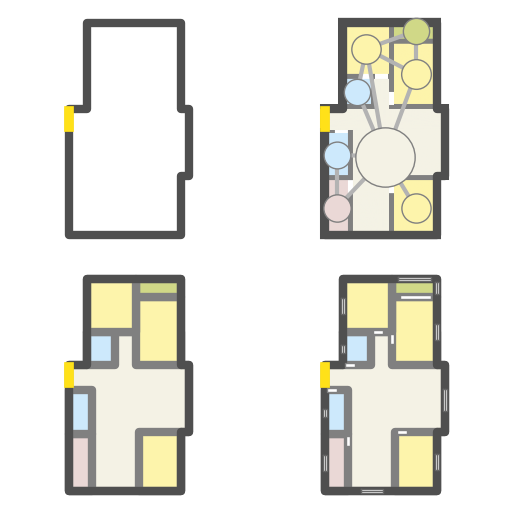

# RPLAN-ToolBox
A tool box for RPLAN dataset.



# Usage

0. Install dependency

    - python>=3.7

    - matlab (for alignment): [Install MATLAB Engine API for Python](https://www.mathworks.com/help/matlab/matlab_external/install-matlab-engine-api-for-python-in-nondefault-locations.html)

    - numpy, scipy, scikit-image, matplotlib

    - shapely (for visualization)

    - faiss (Linux only, for clustering)


1. Load a floorplan

```python
RPLAN_DIR = './data'
file_path = f'{RPLAN_DIR}/0.png'
fp = Floorplan(file_path)
img = fp.image
```

2. Get image channels

```python
fp.boundary
fp.category
fp.instance
fp.inside
```

2. Get vector graphics information

```python
data = fp.to_dict()
print(data.keys())
```

3. Align rooms with boundary, neighbors

```python
from rplan.align import align_fp_gt
boxes_aligned, order, room_boundaries = align_fp_gt(data['boundary'],data['boxes'],data['types'],data['edges'])
data['boxes_aligned'] = boxes_aligned
data['order'] = order
data['room_boundaries'] = room_boundaries
```

4. Add doors and windows for a vector floorplan

```python
from rplan.decorate import get_dw
doors,windows = get_dw(data)
data['doors'] = doors
data['windows'] = windows
``` 

5. Plot floorplan

```python
from rplan.plot import get_figure,get_axes
from rplan.plot import plot_category,plot_boundary,plot_graph,plot_fp
plot_category(fp.category) # raw image
plot_boundary(data['boundary']) # vector boundary
plot_graph(data['boundary'],data['boxes'],data['types'],data['edges']) # node graph
plot_fp(data['boundary'], data['boxes_aligned'][order], data['types'][order]) # vector floorplan
plot_fp(data['boundary'], data['boxes_aligned'][order], data['types'][order],data['doors'],data['windows']) # vector floorplan with doors and windows
```

6. Get the turning function for a boundary

```python
from rplan.measure import compute_tf
from rplan.plot import plot_tf

x,y = compute_tf(data['boundary'])
plot_tf(x,y)
```

7. Cluster turning functions: See `cluster_tf.py`. Linux system and FAISS are required.

8. Retrieve based on the turning function

``` python
import numpy as np
from rplan.measure import TFRetriever
tf = np.load('output/tf_discrete.npy')
tf_centroids = np.load('output/tf_centroids.npy')
tf_clusters = np.load('output/tf_clusters.npy')
retriever = TFRetriver(tf,tf_centroids,tf_clusters)
top_20 = retriever.retrieve_cluster(data['boundary'],k=20,beam_search=True) # Knn search
top_5 = retriever.retrieve_bf(data['boundary'],k=5) # argsort
```

## Acknowledgement
- [RPLAN](http://staff.ustc.edu.cn/~fuxm/projects/DeepLayout/index.html)
- [Graph2Plan](https://github.com/HanHan55/Graph2plan)
